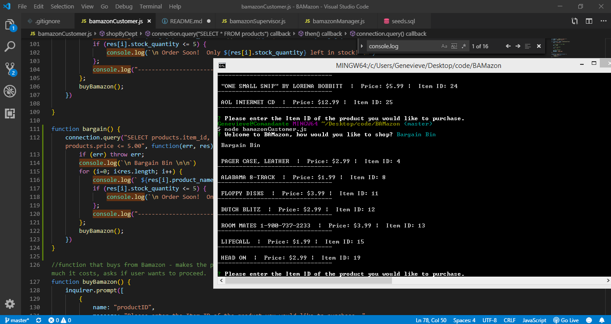

# BAMazon 🛒

BAMazon is a series of 3 Node apps that use MySQL.  The customer app takes orders from customers and depletes from the store inventory.  The manager app tracks sales and offers the ability to create new products and add to existing inventory.  The supervisor app allows the user to track sales by department and create new departments.



## Functionality 💪
#### Here's how I created the app: 

* I started by creating the MySQL database for BAMazon, and created a table with my initial products.  My product list is centered on the idea of useless things in 2019.  I suppose my take on this and the resulting inventory is debatable.  

```mysql
DROP DATABASE IF EXISTS bamazonDB;
CREATE database bamazonDB;

USE bamazonDB;

CREATE TABLE products (
  item_id INT NOT NULL AUTO_INCREMENT,
  product_name VARCHAR(100) NOT NULL,
  department_name VARCHAR(100) NOT NULL,
  price DECIMAL(15,2) NOT NULL,
  stock_quantity INT NULL, 
  product_sales DECIMAL(15,2) NULL, 
  PRIMARY KEY (item_id)
);

INSERT INTO products (product_name, department_name, price, stock_quantity, product_sales)
VALUES ("VHS Tape Rewinder", "Electronics", 690.99, 45, 0), 
("Dial-Up Modem", "Electronics", 6.99, 69, 0), 
("Pager", "Electronics", 699.99, 75, 0), 
```

* I then created my bamazonCustomer.js file, established the connection with my database and built-out the functions necessary for running the app.  The customer is first prompted, using inquirer, how they would like to shop - whether by department, see all products, bargain bin, or exit.  Note: Bargain Bin was added at the very end, to reflect how I like to shop.

* When customers shop by department, they are prompted with the list of departments.  While this was originally hard-coded with the departments I knew to exist, I later realized this had to be accomplished by accessing the products table in order to update with new departments and products as they came available via the manager and supervisor apps.  The following snippet shows how I removed duplicates from that list of departments from my products table, to display within the inquirer prompt. 

```javascript
connection.query("SELECT * FROM products", function(err, res) {
        if (err) throw err;

        inquirer.prompt({
            type: "list",
            name: "department",
            message: "Please choose a department from the following list:",
            choices: function() {

                var departments = res.map(function(product) {
                    return product.department_name
                });
                

                return departments.filter(function(item, index){
                    return departments.indexOf(item) >= index;
                });
            }
        })

```

*  The user is then able to see the list of available products under that department.  When the product has fewer than 5 in inventory, customers see the order soon message with how many products are left in inventory.  I then run my buyBamazon function, which first prompts the user with the Item ID of the product they want to purchase, then the quantity they would like to order.  The user confirms their order after seeing the price, and the database is updated - with the new figures for stock quantity and product sales.  


* When the user makes the initial selection, a switch case handles the user input and results in running different functions.  For the concert, movie or song, the user is then prompted with another question - which artist, movie or song would you like to know more about?  

```
switch(command) {
    case "Spotify This":
        return spotifyThis();
    case "Concert This":
        return concertThis();
    case "Movie This":
        return movieThis();
    case "A Walk on the Wild Side":
        return  doWhatItSays();
    default:
        return console.log("make a better choice")
};
    

function spotifyThis() {
    inquirer.prompt([
        {
            name: "whatSong",
            message: "What song would you like to know more about?"
        }
    ]).then(function(answer) {
        userInput = `"${answer.whatSong}"`;    

        spotThis(userInput);
        
        
    });
};

```

* The user then can type-in their query, and the app will return :
    - Song Information - the most relevant (according to Spotify) artist, album and Spotify song preview URL, for the song that the user searches.
    

    - Upcoming Concerts - the upcoming concert venues, location, date and time, for the artist that the user searches.  Note, there are no returns for artists that aren't touring or aren't in the BandsInTown API. 
    
 
    - Movie Information - the title, year, IMDB & Rotten Tomato ratings, country, language, plot and actors, for the movie that a user searches.  This uses OMDB.
    


* The Walk on the Wild Side option reads my random.txt file.  My tutor helped me to use eval(), instead of another switch case, to run my (already-created) functions.  This method works by turning the first part of the random.txt (movThis, conThis or spotThis) into functions - thereby accessing my functions and returning the redefined userInput variable, which uses the second part (after the comma) of my random.txt.  

```
function doWhatItSays() {
    fs.readFile(randText, "utf8", function(error, data) {
        if (error) return console.log(error);

        var dataArray = data.split(", ");
        var liriCommand = eval(dataArray[0]);
        console.log(liriCommand);

        userInput = dataArray[1];
        liriCommand(userInput);
                    

    });
};

```

* In this case, my random.txt file specifies a movie query, using the movThis command.  If you'd like to try different commands within random.txt, you can use conThis for Concert This, or spotThis for Spotify This.

* A REALLY IMPORTANT NOTE - if you are trying conThis within the random.txt, you need to remove the quotes from your query, as demonstrated in the following picture:
    - 
    - This is because the BandsInTown API doesn't like the quotes for the purposes of its query.  

* Liri will continue to run after creating returns, since it is called within each function.  I experimented with Q to Quit within Inquirer, but couldn't get it to work, so I specify the usual way to exit - ctrl-C.  


## Getting Started 🏁

These instructions will get you a copy of the project up and running on your local machine for grading and testing purposes. 

1. You will need a Spotify API key and secret, saved in a .env file in order for this app to function.
2. clone repository. 
3. open repository in your IDE of choice.
4. Install node packages specified in the package.json - axios, dotenv, inquirer, moment, node-spotify-api.
5. Open the liri-node-app in Bash.
4. Run node liri.js.


## Built With 🔧

* NodeJS
* Spotify API
* BandsInTown API
* OMDB API
* MomentJS
* Inquirer


## Authors ⌨️

* **Genevieve DePriest** - [gdepriest](https://github.com/gdepriest)

## Acknowledgments 🌟

* Amber Burroughs, Tutoring badass
* Lindsey, TA goddess
* Grace, TA goddess
* Sarah Cullen, Maestro
