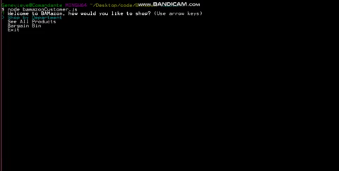

# BAMazon 🛒

BAMazon is a series of 3 Node apps that use MySQL.  The customer app takes orders from customers and depletes from the store inventory.  The manager app tracks sales and offers the ability to create new products and add to existing inventory.  The supervisor app allows the user to track sales by department and create new departments.


## Functionality 💪
#### Here's how I created the app: 

* I started by creating the MySQL database for BAMazon, and created a table with my initial products.  My product list is centered on the idea of useless things in 2019.  I suppose my take on this and the resulting inventory is debatable.  

```mysql
DROP DATABASE IF EXISTS bamazonDB;
CREATE database bamazonDB;

USE bamazonDB;

CREATE TABLE products (
  item_id INT NOT NULL AUTO_INCREMENT,
  product_name VARCHAR(100) NOT NULL,
  department_name VARCHAR(100) NOT NULL,
  price DECIMAL(15,2) NOT NULL,
  stock_quantity INT NULL, 
  product_sales DECIMAL(15,2) NULL, 
  PRIMARY KEY (item_id)
);

INSERT INTO products (product_name, department_name, price, stock_quantity, product_sales)
VALUES ("VHS Tape Rewinder", "Electronics", 690.99, 45, 0), 
("Dial-Up Modem", "Electronics", 6.99, 69, 0), 
("Pager", "Electronics", 699.99, 75, 0), 
```

* I then created my bamazonCustomer.js file, established the connection with my database and built-out the functions necessary for running the app.  The customer is first prompted, using inquirer, how they would like to shop - whether by department, see all products, bargain bin, or exit.  Note: Bargain Bin was added at the very end, to reflect how I like to shop.

* When customers shop by department, they are prompted with the list of departments.  While this was originally hard-coded with the departments I knew to exist, I later realized this had to be accomplished by accessing the products table in order to update with new departments and products as they came available via the manager and supervisor apps.  The following snippet shows how I removed duplicates from that list of departments from my products table, to display within the inquirer prompt. 

```javascript
connection.query("SELECT * FROM products", function(err, res) {
        if (err) throw err;

        inquirer.prompt({
            type: "list",
            name: "department",
            message: "Please choose a department from the following list:",
            choices: function() {

                var departments = res.map(function(product) {
                    return product.department_name
                });
                

                return departments.filter(function(item, index){
                    return departments.indexOf(item) >= index;
                });
            }
        })

```

*  The user is then able to see the list of available products under that department.  When the product has fewer than 5 in inventory, customers see the order soon message with how many products are left in inventory.


* I then run my buyBamazon function, which first prompts the user with the Item ID of the product they want to purchase, then the quantity they would like to order.  The user confirms their order after seeing the price, and the database is updated - with the new figures for stock quantity and product sales.  If the user inputs a quantity greater than is available in stock, they receive a message to select fewer.



* The See All Products and Bargain Bin run in a similar way.  The See All shows all products available for purchase, and the Bargain Bin filters the response by items that have a price that is less than or equal to 5.00.  Both run the buyBamazon function, which prompts the user for the item id and the quantity.


* I then started in with my bamazonManager.js.  This app displays all products (showing sales figures), displays low inventory, adds to inventory and creates new inventory.  Product information is displayed as a table.  I thought this view was appropriate for a manager, but less so the customer.  


* The View Low Inventory returns all item information for products that have 5 or fewer items in stock.


* To add to existing inventory, the user is prompted to input the item id and quantity added.  The database is then updated with the new quantity, which makes more available for the customer to purchase.  


```javascript

function stockShelves() {
    inquirer.prompt([
        {
            name: "productID",
            message: "Please enter the Item ID of the product you would like to update.",
            validate: function(value) {
                if (isNaN(parseInt(value)) || parseInt(value) < 1) {
                    return "Please choose a valid Item ID.";
                };

                return true;
            }
        },
        {
            name: "quantity",
            message: "Enter the quantity added:",
            validate: function(value) {
                if (isNaN(value)) {
                    return "Please enter the number you are adding to the BAMazon stock"
                };
                
                return true;
            },
        }
    ]).then(function(answers) {

        var query3 = "SELECT * FROM products WHERE products.item_id = ?";
        var query4 = "UPDATE products SET ? WHERE products.item_id = ?";

        connection.query(query3, [(parseInt(answers.productID))], function(err, res) {
            if (err) throw err;

            var stockUpdate = res[0].stock_quantity + parseInt(answers.quantity)

            console.log(`There are currently ${res[0].stock_quantity} of ${res[0].product_name}.  Your addition of ${answers.quantity} will make ${stockUpdate}.`);
            inquirer.prompt({
                name: "updateConfirm",
                message: "Do you want to proceed?",
                type: "confirm",
                default: true,
            }).then(function(answer) {

                if (answer.updateConfirm) {                        
                    connection.query(query4, [{stock_quantity: stockUpdate }, parseInt(answers.productID)], function(err, res) {
                        if (err) throw err;

                        console.log(`\n*****************************\n Product stock updated to ${stockUpdate}. \n*****************************\n`);
                        mainMenu();
                        
                    });
    
                } else {
                    mainMenu();
                };

            })
        })


    })
}        

```

* Creating a new product is essentially creating a new row in the products table.  The user submits the product information, adding name, choosing from the list of departments available, adding price and quantity.  The price question is currently only validating for when a user doesn't input a number.  I would like to make it in the future so it validates around a decimal input as 123.45.  


* The product is added to the products table.

```javascript
connection.query("INSERT INTO products SET ?", {
                product_name: answers.product_name, 
                department_name: answers.department_name, 
                price: parseFloat(answers.price), 
                stock_quantity: parseInt(answers.stock_quantity),
                product_sales: parseInt(0)}, function(err) {
                if (err) throw err;
                console.log(`\n\n New product successfully added: \n ${answers.product_name.toUpperCase()} - Department: ${answers.department_name} - Price: $${answers.price} - Quantity: ${answers.stock_quantity}\n\n`);
```

* The product is added to the database and becomes available to the customer.


* I then created the bamazonSupervisor.js app.  This app requires a new table - departments - in the bamazon database.  I created the starter information for that - which includes overhead costs, a dummy amount.

```mysql

USE bamazonDB;

CREATE TABLE departments (
  department_id INT NOT NULL AUTO_INCREMENT,
  department_name VARCHAR(100) NOT NULL,
  over_head_costs DECIMAL(15,2) NOT NULL,
  PRIMARY KEY (department_id)
);

INSERT INTO departments (department_name, over_head_costs)
VALUES ("Kitchen", 999.98), ("Pharmacy/Cosmetics", 825.36), ("Outdoor", 1000), ("Services", 2555.69), ("Movies, Music & Games", 899.67), ("Electronics", 1452.36), ("Travel", 799.420), ("Accessories", 5666.32);


```

* The supervisor has the ability to see product sales by department and create a new department.  To show the product sales by department, I had to join my two tables get the information displaying in the way I wanted.  I knew I was missing something, because all of of the join methods I attempted showed all the products and all the sales, and didn't group those product sales up by department.  Of course, there's a built-in method for that - SUM().  I also needed to use aliases on a couple of the columns.  With the help of our TAs at the homework review session, I was able to get that sorted out.


* The create new department is carried out just like the create new product function in the manager mode.  The supervisor is asked to input the new department and the overhead cost.  The user information is used to create a new row in the departments table.  


* The department then becomes available for the manager to use to create a new product.


## Getting Started 🏁

These instructions will get you a copy of the project up and running on your local machine for grading and testing purposes. 

1. Clone repository. 
3. Open repository in your IDE of choice.
4. Install node packages specified in the package.json - inquirer, mysql.
5. Open MySQL workbench, and create the database and tables using the seeds.sql document.
4. Open Bash or Terminal, run ```node bamazonCustomer.js```, ```node bamazonManager.js``` or ```node bamazonSupervisor.js```.


## Built With 🔧

* NodeJS
* Spotify API
* BandsInTown API
* OMDB API
* MomentJS
* Inquirer


## Authors ⌨️

* **Genevieve DePriest** - [gdepriest](https://github.com/gdepriest)

## Acknowledgments 🌟

* Amber Burroughs, Tutoring badass
* Lindsey, TA goddess
* Grace, TA goddess
* Sarah Cullen, Maestro
